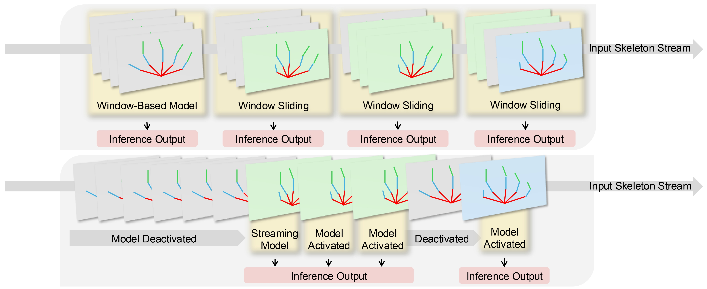

# Duo Streamers: A Streaming Gesture Recognition Framework

  
**Boxuan Zhu**1,2 <boxuan.zhu@liverpool.ac.uk>  
**Sicheng Yang**1 <940863869@qq.com>  
**Zhuo Wang**1 <zhuohci01@gmail.com>  
**Haining Liang**3 <hainingliang@hkust-gz.edu.cn>  
**Junxiao Shen**4,[&#9993;] <junxiao.shen@bristol.ac.uk>

 

1 OpenInterX  
2 University of Liverpool  
3 HKUST (Guangzhou)  
4 University of Bristol  

 

  

  <video width="640" controls>
    <source src="DuoStreamers_Visualization.mp4" type="video/mp4">
  </video>

